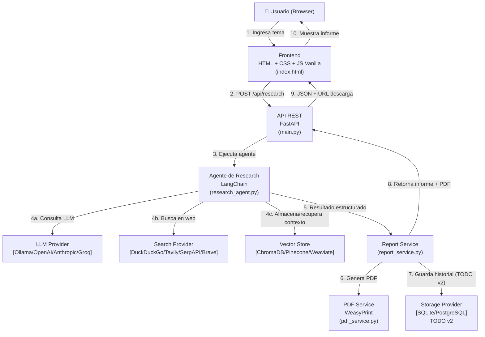

# Arquitectura del Agente de Research

## Diagrama de Arquitectura



```
┌─────────────────────────────────────────────────────────────────┐
│                         BROWSER (Usuario)                        │
│              [HTML + CSS + JS Vanilla — index.html]              │
└──────────────────────────────┬──────────────────────────────────┘
                               │ HTTP REST
                               ▼
┌─────────────────────────────────────────────────────────────────┐
│                         FastAPI (main.py)                        │
│   POST /api/research    GET /api/reports    GET /api/pdf/{id}    │
└──────────────────────────────┬──────────────────────────────────┘
                               │
                               ▼
┌─────────────────────────────────────────────────────────────────┐
│                   Research Agent (LangChain)                     │
│                      research_agent.py                           │
│                                                                  │
│   ┌─────────────┐   ┌─────────────┐   ┌──────────────────────┐  │
│   │ search_tool │   │  LLM calls  │   │   Context Manager    │  │
│   │  (tools/)   │   │  (síntesis) │   │   (ChromaDB)         │  │
│   └──────┬──────┘   └──────┬──────┘   └──────────────────────┘  │
└──────────┼─────────────────┼──────────────────────────────────-─┘
           │                 │
           ▼                 ▼
┌─────────────────┐  ┌───────────────────────────────────────────┐
│ Search Provider │  │              LLM Provider                  │
│  (providers/    │  │           (providers/llm/)                 │
│   search/)      │  │                                           │
│                 │  │  ┌────────────┐   ┌────────────────────┐  │
│ DuckDuckGo ✅   │  │  │   Ollama   │   │  OpenAI (TODO)     │  │
│ Tavily    TODO  │  │  │  llama3 ✅  │   │  Anthropic (TODO)  │  │
│ SerpAPI   TODO  │  │  └────────────┘   └────────────────────┘  │
│ Brave     TODO  │  └───────────────────────────────────────────┘
└─────────────────┘
           │
           ▼
┌─────────────────────────────────────────────────────────────────┐
│                     Services Layer                               │
│                                                                  │
│   ┌─────────────────────────┐   ┌──────────────────────────┐    │
│   │     Report Service      │   │      PDF Service          │    │
│   │   (report_service.py)   │   │   (pdf_service.py)        │    │
│   │                         │   │   WeasyPrint ✅            │    │
│   └─────────────────────────┘   └──────────────────────────┘    │
│                                                                  │
│   ┌─────────────────────────┐   ┌──────────────────────────┐    │
│   │     Vector Store        │   │   Storage Provider        │    │
│   │   ChromaDB (local) ✅    │   │   SQLite (TODO v2)        │    │
│   │   Pinecone     TODO     │   │   PostgreSQL (TODO v2)    │    │
│   └─────────────────────────┘   └──────────────────────────┘    │
└─────────────────────────────────────────────────────────────────┘

✅ = Implementado en v1   TODO = Futuras versiones
```

---

## Decisiones Técnicas

### 1. FastAPI como framework de API

**Decisión:** FastAPI sobre Flask o Django REST Framework.

**Razones:**
- Soporte nativo de async/await — el agente hace múltiples búsquedas en paralelo
- Validación automática con Pydantic — tipos seguros en los modelos de request/response
- Documentación automática en `/docs` (Swagger UI) sin configuración adicional
- Performance superior para operaciones I/O-bound (búsquedas web, llamadas a LLM)

---

### 2. LangChain para orquestación del agente

**Decisión:** LangChain sobre construir el agente desde cero o usar LlamaIndex.

**Razones:**
- Abstracción de `Tool` que permite encadenar búsqueda → análisis → síntesis
- Soporte nativo para múltiples LLM providers (Ollama, OpenAI, Anthropic) con interfaz unificada
- `AgentExecutor` maneja la lógica de cuándo buscar más información vs. cuándo sintetizar
- Comunidad activa y mantenimiento continuo

**Trade-off aceptado:** LangChain agrega ~100ms de overhead por llamada, pero simplifica enormemente el mantenimiento del agente.

---

### 3. Ollama + llama3 como LLM por defecto

**Decisión:** Ollama sobre APIs de pago para la versión base.

**Razones:**
- Completamente gratuito y funciona offline
- llama3 (8B o 70B) tiene buena performance para síntesis en español
- Misma interfaz que OpenAI — migrar es cambiar 2 variables de entorno
- Privacidad total: los datos del club no salen del servidor

**Trade-off aceptado:** La calidad de síntesis es inferior a GPT-4 o Claude. Para el portfolio y el club, es suficiente. Cuando haya presupuesto, se cambia a Claude/GPT-4 en `.env`.

---

### 4. DuckDuckGo Search como proveedor de búsqueda

**Decisión:** DuckDuckGo sobre Tavily o SerpAPI para la versión base.

**Razones:**
- Sin API key — funciona desde el primer `docker-compose up`
- Cobertura suficiente para búsquedas en español sobre temas locales
- La librería `duckduckgo-search` es estable y bien mantenida

**Trade-off aceptado:** Sin control sobre cantidad de resultados, sin búsqueda de noticias recientes garantizada. Tavily o Brave Search (con API key gratuita) mejoran esto cuando sea necesario.

---

### 5. ChromaDB como vector store

**Decisión:** ChromaDB sobre FAISS o Pinecone.

**Razones:**
- Persistencia en disco sin servidor adicional (a diferencia de FAISS que es in-memory)
- API simple y bien documentada
- Permite buscar contexto de búsquedas previas del mismo tema en la sesión

**Trade-off aceptado:** No escala horizontalmente. Para un equipo de 3-5 personas es más que suficiente.

---

### 6. SQLite para historial (TODO v2)

**Decisión:** SQLite sobre PostgreSQL para la versión inicial.

**Razones:**
- Sin servidor adicional — el archivo `.db` vive en el volumen Docker
- SQLAlchemy permite migrar a PostgreSQL cambiando la connection string en `.env`
- Para 3-5 usuarios y decenas de informes por mes, SQLite es más que suficiente

**Nota:** El esquema del modelo `Report` se define en v1 para facilitar la migración, pero las operaciones de escritura/lectura se implementan en v2.

---

### 7. Frontend en HTML/CSS/JS vanilla

**Decisión:** Sin frameworks de frontend.

**Razones:**
- Cero dependencias de npm — no hay `node_modules` que mantener
- El caso de uso es simple: un formulario, una lista, un PDF
- Reducción del tiempo de carga: la página pesa < 50KB total
- Más fácil de entender para quien haga mantenimiento sin experiencia en React/Vue

---

### 8. WeasyPrint para generación de PDF

**Decisión:** WeasyPrint sobre ReportLab o FPDF2.

**Razones:**
- Genera PDF desde HTML/CSS — el mismo template visual del frontend puede usarse para el PDF
- Soporte nativo de UTF-8 y caracteres en español sin configuración adicional
- El diseño del PDF se controla con CSS estándar

**Trade-off aceptado:** WeasyPrint tiene dependencias del sistema (Cairo, Pango) que están incluidas en el Dockerfile.

---

## Principio de Intercambiabilidad de Proveedores

Todos los proveedores externos siguen este patrón:

```
providers/
├── base.py              ← Interfaces abstractas (ABC)
├── llm/
│   ├── base_llm.py      ← class BaseLLMProvider(ABC)
│   ├── ollama_provider.py    ← class OllamaProvider(BaseLLMProvider)
│   └── openai_provider.py   ← class OpenAIProvider(BaseLLMProvider) [TODO]
├── search/
│   ├── base_search.py   ← class BaseSearchProvider(ABC)
│   ├── duckduckgo_provider.py
│   └── tavily_provider.py   [TODO]
└── storage/
    ├── base_storage.py  ← class BaseStorageProvider(ABC)
    ├── sqlite_provider.py   [TODO v2]
    └── postgres_provider.py [TODO v2]
```

**Regla de oro:** `config.py` lee las variables de entorno y devuelve la instancia correcta del provider. El agente y los servicios nunca importan directamente `OllamaProvider` ni `DuckDuckGoProvider` — solo usan `BaseLLMProvider` y `BaseSearchProvider`.

```python
# config.py — así se selecciona el provider
def get_llm_provider() -> BaseLLMProvider:
    proveedor = os.getenv("LLM_PROVIDER", "ollama")
    if proveedor == "ollama":
        return OllamaProvider(...)
    elif proveedor == "openai":
        return OpenAIProvider(...)  # TODO
    else:
        raise ValueError(f"Proveedor LLM desconocido: {proveedor}")
```

Cambiar de Ollama a OpenAI = cambiar `LLM_PROVIDER=ollama` a `LLM_PROVIDER=openai` en `.env`.

---

## Estructura de Datos del Informe

```
InformeResearch
├── id: str (UUID)
├── tema: str
├── fecha_creacion: datetime
├── resumen_ejecutivo: str
├── puntos_a_favor: List[str]
├── puntos_en_contra: List[str]
├── analisis_sentimiento: Dict
│   ├── clasificacion: "positivo" | "negativo" | "neutro"
│   ├── puntaje: float (-1.0 a 1.0)
│   └── justificacion: str
├── conclusiones: str
├── recomendaciones: List[str]
└── fuentes: List[Fuente]
    ├── titulo: str
    ├── url: str
    └── fecha_consulta: datetime
```
